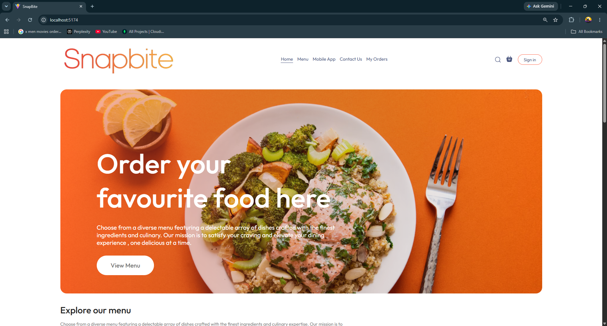

# 🍔 SnapBite – Your Smart Online Food Ordering Solution

**SnapBite** is a full-featured, modern web application that allows users to **browse food menus, manage their cart, place secure orders**, and track them in real time. Built with **React.js**, **Node.js**, and **MongoDB**, SnapBite delivers a seamless food ordering experience — from browsing to billing.

<h1>
  For Security reasons Please wait for 30 Second As the will have to load and estalish a realiable network.
</h1>

> 💻 **Live Project**: [Click here to explore SnapBite]()  
> 🛠️ **Source Code**: [GitHub Repo](https://github.com/)

---

## 🌟 Key Features

- 🧾 **User Registration & JWT Authentication**
- 🛍️ **Cart Management with Real-Time Total Updates**
- 💸 **Stripe Integration for Secure Payments**
- 📦 **Order Summary, Confirmation & Email Receipt**
- 📋 **Admin Panel for Menu & Order Management**
- 📱 **Mobile-Responsive Interface**
- 📊 **Order History & Reorder Option**
- 📡 **Order Tracking System (Real-Time Updates)**

---

## 🔧 Tech Stack

| Layer        | Technology            |
|--------------|------------------------|
| **Frontend** | React.js, Tailwind CSS |
| **Backend**  | Node.js, Express.js    |
| **Database** | MongoDB + Mongoose     |
| **Auth**     | JWT (JSON Web Token)   |
| **Payments** | Stripe API             |
| **Hosting**  | Vercel (Frontend), Render (Backend) |

---

## 🧭 How SnapBite Works

1. **User signs up** and logs in securely.
2. Browse the menu categorized by food type (Salads, Shakes, Rolls, etc.).
3. Add items to the cart, adjust quantities, and review the order.
4. Proceed to payment using **Stripe** for secure checkout.
5. Receive order confirmation and a tracking ID via email.
6. Admin can manage food listings, orders, and update status.

---

## 🧑‍💻 For Developers

If you're looking to learn:
- Full-stack web app development
- API integration (Stripe, JWT)
- Responsive UI/UX design
- Building secure user sessions

SnapBite is the perfect launchpad 🚀

---

## 🧑‍🍳 Created By

**Manish3-4**  
Connect on [GitHub](https://github.com/manish3-4)

---

## 📄 License

This project is licensed under the MIT License. Feel free to fork it, improve it, and share it with your own twist!

---

## 📸 Preview Screens

> _(Add screenshots here showing: Homepage, Menu, Cart, Payment, Admin Panel, Order History)_

 

 

 

 

 

 

 

 

> “Built to satisfy your hunger — digitally and deliciously.” 🍕🛵
